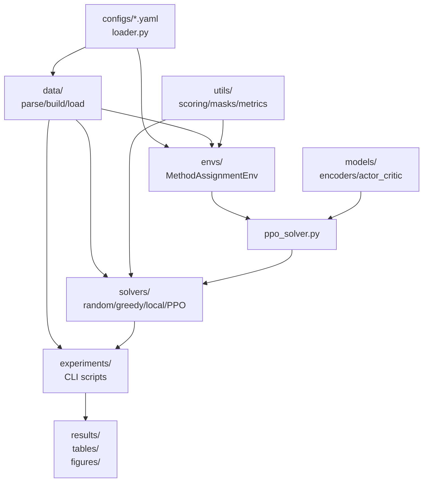
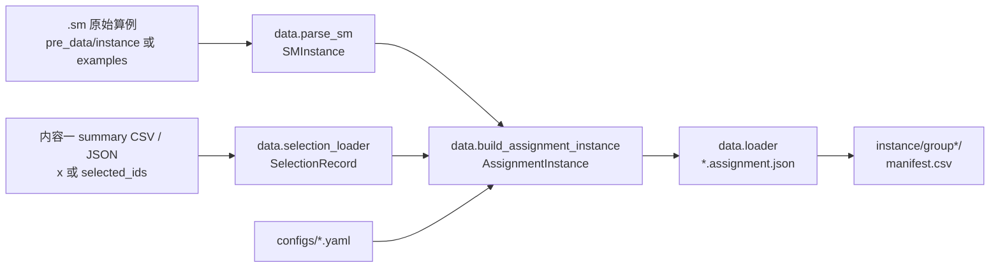
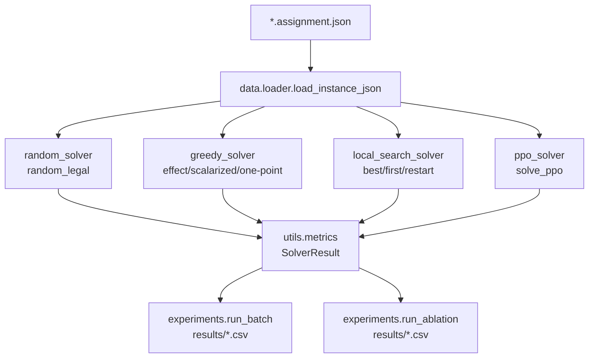
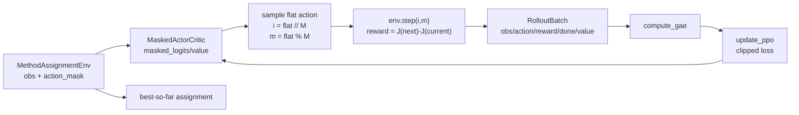
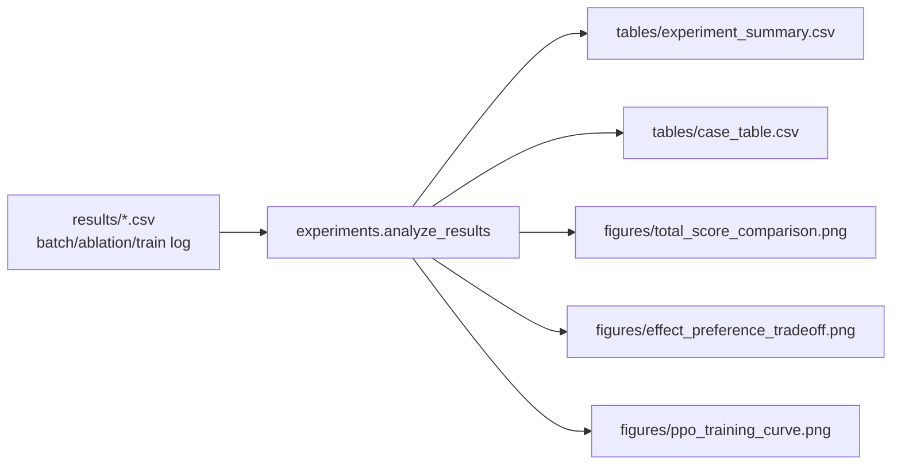

# 项目结构与脚本调用关系

本文档用于快速理解 `Resource_Allocation` 项目的文件职责、核心数据流和脚本调用关系。当前核心包是 `pa_moap_rl`，目标是把内容一阶段选中的知识点集合转换为内容二教学方法分配算例，并通过 baseline、局部搜索或 PPO 求解。

## 目录职责

- `pa_moap_rl/configs/`：读取并校验 YAML 配置，包括知识点类别、教学方法、效果矩阵、画像、目标分布、目标权重和训练参数。
- `pa_moap_rl/data/`：解析 `.sm`、读取内容一选择结果、构造/保存/加载 `AssignmentInstance`。
- `pa_moap_rl/utils/`：提供目标函数评分、静态/动态 mask、统一实验指标。
- `pa_moap_rl/envs/`：封装教学方法分配环境，动作为单点替换 `(node_index, method_index)`。
- `pa_moap_rl/models/`：实现 encoder 与 masked Actor-Critic 网络。
- `pa_moap_rl/solvers/`：实现 random、greedy、local search 和 PPO 求解器。
- `pa_moap_rl/experiments/`：提供命令行实验入口、批量训练、消融和结果分析。
- `examples/`：保留可提交的小型示例输入。
- `pre_data/`、`instance/`、`instance_profile_v2/`、`results/`、`figures/`、`tables/*.csv`：本地数据或实验产物，默认由 `.gitignore` 忽略。

## 总体依赖图



## 数据转换流程



关键编号约定：

- `.sm` 原始节点使用 `nodnr`，通常从 1 开始。
- 内容一选择向量满足 `x[j-1] == 1 -> nodnr == j` 被选中。
- 内容二 `AssignmentInstance` 会把选中节点重新编号为本地 `0..N-1`。
- solver、env 和 model 都只使用本地编号，不再直接处理 `.sm` 原始编号。

常用命令：

```powershell
.\.venv\Scripts\python -m pa_moap_rl.data.convert_pre_data --output-root instance --overwrite
```

## 求解与实验流程



baseline 的差异：

- `random_legal`：只从每行 `feasible_mask` 中随机采样可行方法。
- `effect_only_greedy`：每个知识点独立选择理论效果最高的方法。
- `scalarized_independent_greedy`：每个知识点独立最大化局部加权效果/偏好。
- `local_search_best_improvement`：在完整目标 `J` 上接受收益最大的单点替换，直到无正收益动作。

常用命令：

```powershell
.\.venv\Scripts\python -m pa_moap_rl.experiments.run_batch --group group1 --limit 5 --output-csv results/batch_results.csv
.\.venv\Scripts\python -m pa_moap_rl.experiments.run_ablation --group group1 --limit 5 --output-csv results/ablation_results.csv
```

## PPO 训练流程



单实例 PPO：

```powershell
.\.venv\Scripts\python -m pa_moap_rl.experiments.train_ppo --instance-json instance/group1/inst_V60_w6-10_s670487.assignment.json --device cpu --updates 20
```

共享批 PPO：

```powershell
.\.venv\Scripts\python -m pa_moap_rl.experiments.train_ppo_batch --group group1 --limit 10 --eval-limit 2 --updates 20 --instances-per-update 2 --rollout-steps 64 --device auto --output-dir results/ppo_batch_group1_pilot
```

共享批 PPO 的关键约束：

- 同一个共享模型要求训练/评估实例的类别数 `K` 和方法数 `M` 一致。
- `eval_limit` 选出的前若干实例固定为评估集，其余实例用于训练；实例太少时会复用全集训练。
- `train_log.csv` 记录训练过程，`eval_log.csv` 记录 policy 和 baseline 的评估结果。
- `best_assignments/update_*/` 保存每次评估时当前 policy 的 best assignment。

## 结果分析流程



常用命令：

```powershell
.\.venv\Scripts\python -m pa_moap_rl.experiments.analyze_results --input results/batch_results.csv results/ablation_results.csv
```

## 命令入口对照表

| 入口 | 主要输入 | 主要调用 | 主要输出 |
| --- | --- | --- | --- |
| `pa_moap_rl.data.convert_pre_data` | `pre_data/instance`、`pre_data/x`、YAML 配置 | `selection_loader`、`parse_sm`、`build_assignment_instance`、`loader.save_instance_json` | `instance/group*/ *.assignment.json`、`manifest.csv` |
| `pa_moap_rl.experiments.run_batch` | `instance/**/*.assignment.json` | random/greedy/local/PPO solver、`metrics` | `results/batch_results.csv` |
| `pa_moap_rl.experiments.run_ablation` | `instance/**/*.assignment.json` | 消融 variant、local search、random initial | `results/ablation_results.csv` |
| `pa_moap_rl.experiments.train_ppo` | 单个 assignment JSON 或 `examples/` smoke 输入 | `ppo_solver.solve_ppo` | PPO 日志、checkpoint、best assignment |
| `pa_moap_rl.experiments.train_ppo_batch` | 一组 assignment JSON | shared `MaskedActorCritic`、`collect_rollout`、`update_ppo`、baseline eval | train/eval CSV、checkpoint、best assignments、TensorBoard |
| `pa_moap_rl.experiments.analyze_results` | 实验结果 CSV | pandas 聚合、matplotlib 绘图 | `tables/` 和 `figures/` 产物 |

