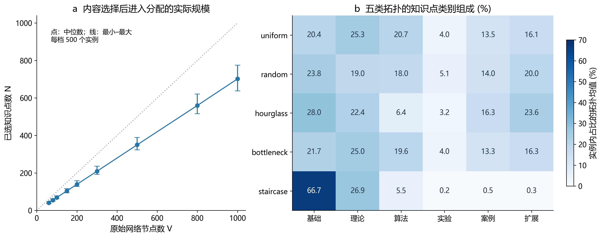
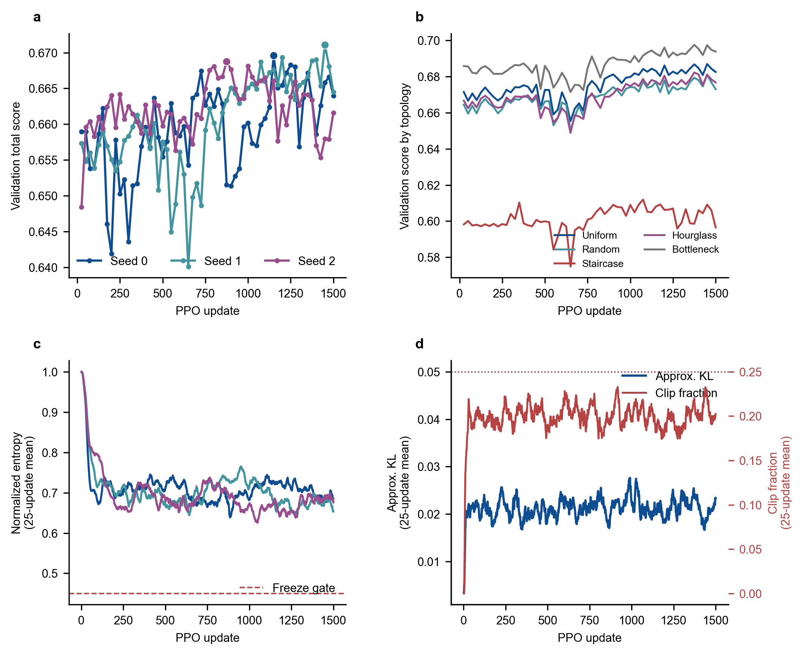
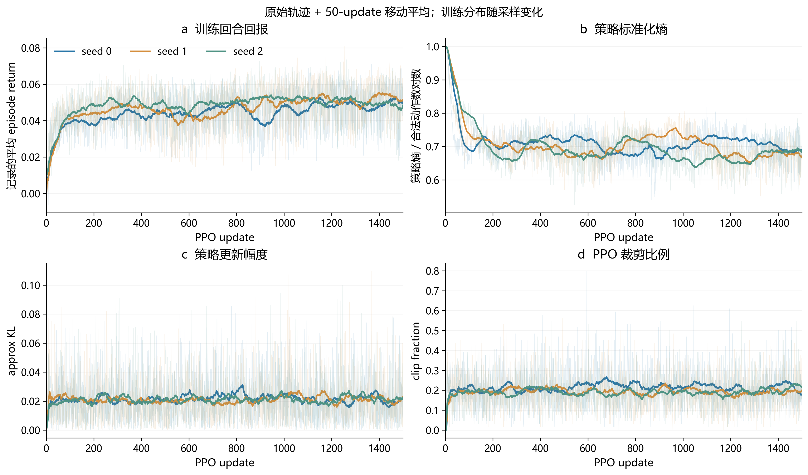
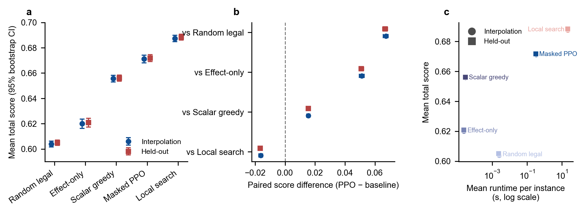
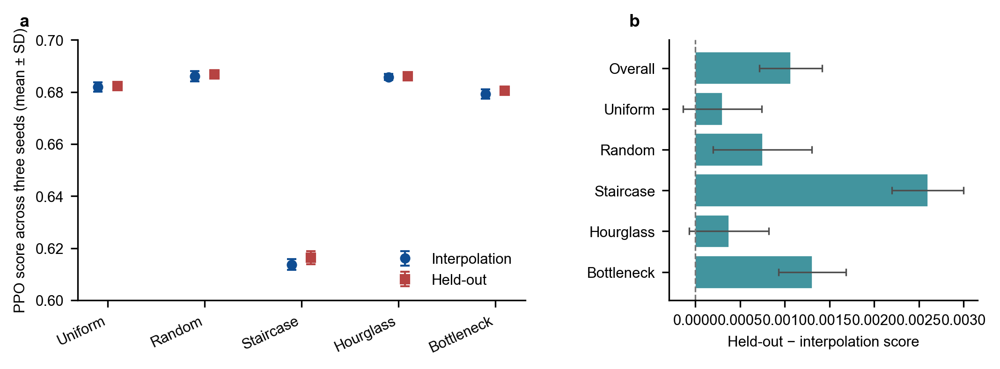
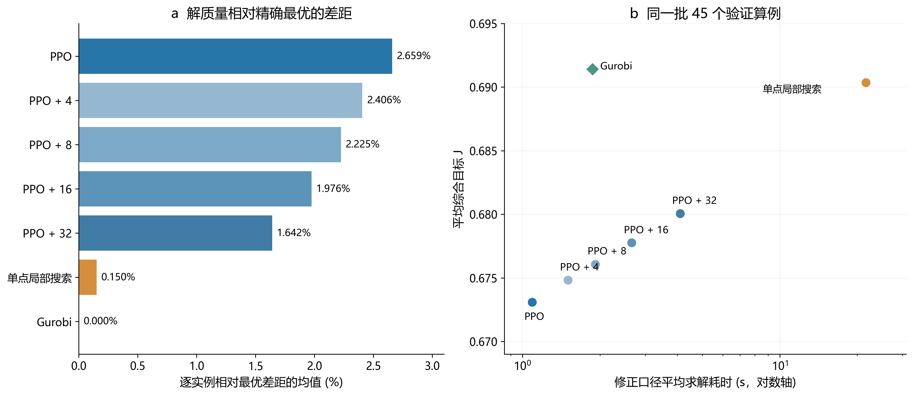
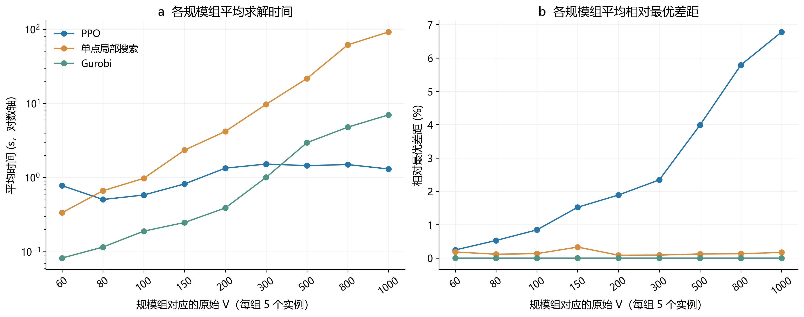
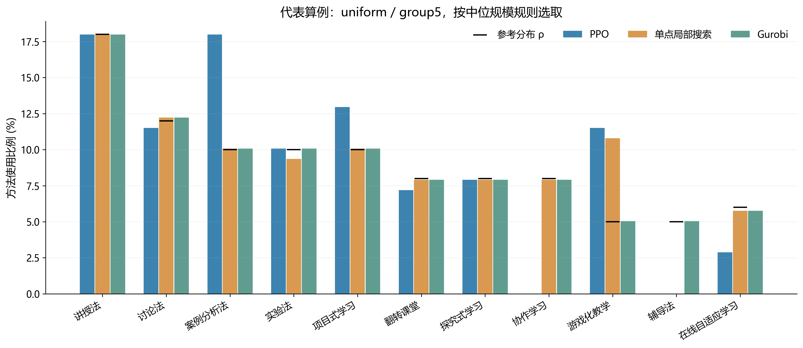

# PPO 教学方法分配：阶段性成果汇报

**研究状态截止：2026 年 9 月 8 日 22:45（北京时间）**  
整理时间：2026 年 9 月 27 日。以下统计由截止时点以前保存的五拓扑实验数据重新汇总；新绘制的图表不代表新增训练或新增求解实验。

## 1. 本阶段完成了什么

本阶段已将“为已选知识点分配教学方法”的方案落实为可运行的偏好感知优化系统，完成了算例转换、数据划分、Masked PPO 实现、多环境联合训练、超参数筛选、三种子训练，以及构造式算法、单点局部搜索和 Gurobi 的初步对比。

可以用于汇报的主结论是：**共享 PPO 能够从教学效果贪婪初解出发提高综合目标，在两类测试中均优于简单基线；相对当前 Python 单点局部搜索，具有较低的推理耗时，但解质量仍有差距。精确求解试验进一步量化了差距，也明确了后续改进方向。**

| 工作环节 | 截止时点的完成状态 | 直接证据 |
|---|---|---|
| 算例接入 | 五类拓扑、九档规模，共 4500 个方法分配实例 | manifest、assignment JSON、内容选择 CSV |
| 数据与场景 | 3150/675/675 分组划分；30 个训练画像组合、6 个留出组合 | split CSV、固定 scenario bank |
| PPO 实现 | 动作掩码、Actor–Critic、GAE、clipped PPO、best-so-far、断点恢复与监控 | 代码、checkpoint、逐更新和逐实例日志 |
| 参数筛选 | 基准 B 与 C1–C4 的 300-update 受控比较 | 候选统计表与配对计划核对 |
| 正式训练 | seed0/1/2 各完成 1500 updates | 每种子 1500 条更新、6000 次实例采样、60 个验证点 |
| 测试比较 | interpolation 与 held-out 各 675 个配对样本 | 每套 5 算法 × 675 行；另有三种子 PPO |
| 精确与混合对照 | 45 个 validation 算例 × 7 种方法 | 315 行配对结果、最优界、完整 assignment |
| 尚未完成 | 完整的偏好/初解/全局项消融，任意权重与目标分布泛化，动态修正、批量服务收益验证 | 不能将计划写成已实现优势 |

这是一份阶段汇报。参数冻结只指此次五拓扑实验版本，不意味着课题设计和算法改进已全部结束。

## 2. 问题、目标和实现边界

前置内容选择阶段输出二进制向量 x，本阶段保留选中的 N 个知识点，为每个知识点选择 11 种教学方法之一。原始网络规模记为 V，方法分配规模记为 N；二者不能混称。

采用的综合评价为：

**J = 0.30 F_E + 0.25 F_S + 0.25 F_T + 0.10 F_G − 0.10 V_soft。**

F_E 是理论教学效果匹配均值，F_S/F_T 是学生/教师偏好匹配均值；F_G = 1 − 0.5∑|π_m−ρ_m|，衡量整体方法分布与参考分布的接近程度。V_soft 是“归一化方法分布熵低于 0.55”的平方惩罚与“任一方法比例超过 0.35”的平方惩罚之和，内部系数均为 1。

固定参考分布为 `[0.18, 0.12, 0.10, 0.10, 0.10, 0.08, 0.08, 0.08, 0.05, 0.05, 0.06]`，顺序对应 11 种方法。正向权重之和为 0.90，因而不能把 J≈0.67 解读为“完成了理论最优的 67%”；最优程度应由 Gurobi 的实例最优值判断。

硬约束是唯一分配与方法可用性。方法熵和占比上限属于软惩罚，**硬可行率 100% 不等于软约束违反为零**。本批 4500 个实例的静态可用性矩阵均为全真，动态掩码会继续排除当前方法与 padding 节点。因此零非法动作证明了掩码执行正确，但尚不能据此声称在大量复杂禁用规则下已验证鲁棒性。

Effect-only greedy 只提供初解；后续 PPO 优化完整 J，允许 F_E 为其他分量让步。当前没有 F_E 下限或词典序约束，不能表述为“始终保证教学效果，再优化偏好”。教学匹配和偏好分数来自规则与合成画像，尚不是教学干预测得的学习成效。

## 3. 算例处理与数据集构建

### 3.1 从原算例到方法分配实例

1. 按拓扑目录匹配 `.sm` 与内容一选择 CSV，只读取 `row_type=instance` 的记录。
2. 从 `.sm` 读取类别 `type` 和认知负荷 `q_2`。CSV 的 x[j−1]=1 对应原始节点编号 j，保留原编号和本地下标映射。
3. 按选中节点抽取类别与认知负荷，生成 N×6 知识点需求向量：前五维取类别原型，第六维取认知负荷。
4. 固定方法属性矩阵为 11×6，固定方法—类别效果矩阵为 11×6；查表生成 N×11 的教学效果矩阵。
5. 构造知识点—方法交互特征：前五维为需求与方法属性逐维乘积，负荷维为 0.6q_i+0.4r_m6；由学生/教师画像分别计算 N×11 偏好矩阵。
6. 写出 assignment JSON 与 manifest，使用 `topology/group/instance` 分层路径，避免跨拓扑同名文件覆盖。输入名 `manual_bottleneck` 在实验元数据中规范为 `bottleneck`。

原始先修边、资源容量等属于前置选择问题；本阶段依赖前置选择结果，不重新优化内容集合，也未将原始图邻接关系直接送入策略网络。因此“跨拓扑”在此指跨来源内容结构及属性分布，不是未见图结构上的 GNN 泛化。

### 3.2 规模与划分

| 规模组 | 原始 V | 实例数 | 实际 N 范围 | N 中位数 |
|---|---|---|---|---|
| group1 | 60 | 500 | 37–47 | 41 |
| group2 | 80 | 500 | 50–61 | 55 |
| group3 | 100 | 500 | 63–78 | 69 |
| group4 | 150 | 500 | 94–116 | 104 |
| group5 | 200 | 500 | 128–158 | 139 |
| group6 | 300 | 500 | 192–236 | 209 |
| group7 | 500 | 500 | 323–389 | 350 |
| group8 | 800 | 500 | 516–621 | 560 |
| group9 | 1000 | 500 | 638–775 | 702 |

五类拓扑为 uniform、random、hourglass、bottleneck、staircase。每个拓扑—规模单元有 100 个实例，总计 5×9×100=4500。实际 N 为 37–775，11N 个候选知识点—方法位置最多为 8525。

| 拓扑 | 训练 | 验证 | 测试 |
|---|---|---|---|
| bottleneck | 630 | 135 | 135 |
| hourglass | 630 | 135 | 135 |
| random | 630 | 135 | 135 |
| staircase | 630 | 135 | 135 |
| uniform | 630 | 135 | 135 |

划分种子为 20260906，比例 70%/15%/15%，以 `group + 原始随机种子` 标识的底层实例分组。对应 630/135/135 个底层身份，五种拓扑变体始终同属一个 split。每个拓扑—规模单元分配 70/15/15 个实例。

本次重新核查了全部 4500 个 JSON 的规模与矩阵形状，逐一对照原始选择 CSV 的 x 与 selected_ids，并检查三集合的底层身份交集为空。训练元数据保存的三个输入文件哈希在三种子中均匹配。核对结果见 [audit_checks.csv](tables/audit_checks.csv)。

图中类别占比先按实例计算，再在拓扑内平均。staircase 的基础类平均占 66.65%，基础+理论约 93.55%，与其余拓扑有明显差别；这提供了分层分析的依据，尚不能证明差距全部由类别组成导致。

### 3.3 偏好场景处理

学生与教师各定义六类模板，共 36 种组合。30 种组合用于训练及插值评估，6 种仅用于 held-out 组合评估：S1–T4、S2–T5、S3–T6、S4–T1、S5–T2、S6–T3。各单独模板训练时都出现过，留出的是组合。

训练时在线加入标准差 0.05 的正态扰动，单维扰动截断在 ±0.10，画像裁剪到 [0.05,0.95]。固定验证插值库含 30 个场景，测试插值库含 60 个场景，测试 held-out 库含 30 个场景。评估按固定实例索引与场景库循环配对，**每套测试是 675 个 instance–scenario 样本，不是 675×全部场景的笛卡尔积**。

## 4. PPO 实现和训练流程

主流程为：**Effect-only greedy 初解 → Masked PPO 单点替换 → 返回搜索期间最高 J 的分配方案。**

状态包括知识点类别、需求向量、当前方法、方法属性、教学效果和双主体偏好矩阵、当前/目标方法分布、目标分项及动作掩码。节点编码器、方法编码器和全局编码器均使用 MLP；全局表示通过 masked mean pooling 汇聚变长节点。候选动作特征包含节点、方法、全局表示及局部分数/增量，维数为 3H+9，H=64。Actor 为每个合法 (i,m) 输出 logit，Critic 预测状态价值。

动作为把一个知识点改用另一种方法，奖励为 ΔJ。训练允许负奖励动作，环境保存 best-so-far；推理使用确定性动作选择，至多 128 步，连续 32 步未刷新最佳值提前结束。训练 rollout 长度也是 128，但 rollout 内可因回合结束重置环境，不能将 1500 updates 等同为 1500 个完整 episode。

每次更新选取相近规模的 4 个不同内容实例，尽量覆盖不同拓扑，使用同一策略同步采样；每条轨迹分别计算并标准化 GAE，然后合并 512 条 transition，统一打乱并做 PPO 更新。padding 与 node mask 支持不同 N。

| 参数 | 最终训练值 |
|---|---:|
| 训练种子 | 0、1、2 |
| 每种子更新数 | 1500 |
| rollout mode | joint |
| 环境数 × 每环境步数 | 4 × 128 |
| minibatch / PPO epochs | 64 / 4 |
| 学习率 / entropy coef | 3×10⁻⁴ / 0.01 |
| hidden dimension | 64 |
| γ / GAE λ | 0.99 / 0.95 |
| clip ε / value coef | 0.20 / 0.50 |
| max grad norm | 0.50 |
| target KL 提前停止 | 最终关闭 |
| 固定验证 | 每 25 updates；90 个实例，5 拓扑×9 规模×2 |
| checkpoint | 每 25 updates；best 按验证选，latest 用于恢复 |

运行记录为 Windows、Python 3.11.9、PyTorch 2.12.0+cu126、RTX 4060 Laptop GPU。Gurobi 为 12.0.3；历史日志记录 CPU 为 14 核 20 线程，pilot 使用 20 个线程。这里列出的是历史运行环境，不是本次报告生成环境。

## 5. 参数筛选与训练过程

### 5.1 为什么选择当前参数

B 为 lr=3e−4/epochs=4；C1 减为 3 epochs，C2 减为 2 epochs，C3 改 lr=2e−4，C4 设置 target KL=0.03。候选均从相同 seed0 起点训练 300 updates，实例与场景调度逐项配对。选择同时看验证质量、最弱拓扑退化、策略熵、KL、clip 和可行性，不只挑最高的一次均值。

| 候选 | 质量分 S | 最佳验证 J | KL P90 | 最弱拓扑差 | 资格 |
|---|---|---|---|---|---|
| B | 0.654349 | 0.662251 | 0.04420 | 0.000000 | 通过 |
| C1 | 0.657075 | 0.658264 | 0.04085 | -0.006885 | 未通过 |
| C2 | 0.655388 | 0.657917 | 0.03650 | -0.006810 | 未通过 |
| C3 | 0.650257 | 0.658985 | 0.03601 | -0.006830 | 未通过 |
| C4 | 0.652867 | 0.657824 | 0.04529 | -0.007834 | 未通过 |

综合质量分 S = 0.5×全部验证均值 + 0.3×末四点均值 + 0.2×最佳验证分。C1/C2 虽降低部分更新幅度指标，但最佳分数和最弱拓扑未达门槛；C3 另出现策略熵衰减；C4 未改善质量。最终保留 B，没有把“计划中的候选 600-update 晋级”写成所有候选都实际执行过。三种子通过 1000-update 检查后，满足至少两个种子在 update 800 后刷新最佳的延长条件，统一完成到 1500。

### 5.2 三种子结果与耗时

| 种子 | 最佳 update | 最佳验证 J | 最终验证 J | 更新计算/分钟 | 验证推理/分钟 |
|---|---|---|---|---|---|
| 0 | 1150 | 0.669582 | 0.663991 | 48.46 | 36.77 |
| 1 | 1450 | 0.671094 | 0.664512 | 32.67 | 23.79 |
| 2 | 875 | 0.668755 | 0.661607 | 31.65 | 24.98 |

每个种子 6000 次实例访问、768000 条 transition；三种子共 2304000 条 transition。日志累计更新计算时间约 112.78 分钟，验证实例推理时间约 85.55 分钟，合计约 3.31 小时；**这是有效日志中两类计时之和，不是完整墙钟时间，也不含参数搜索、无效恢复分支、启动和 checkpoint 写入等成本**。

最佳验证 J 的三种子均值为 0.669811，总体标准差约 0.000969；按固定验证选择 seed1/update1450 作为部署模型。seed2 的最佳点较早，延长训练未刷新最佳，最终点还存在回撤。所有正式记录中非法动作数为零。

优先讲固定验证曲线：它在同一批 90 个样本上比较不同 checkpoint，能反映模型进展与回撤。训练平均 reward/episode return 因实例、规模、画像和回合重置而变化，作为学习诊断，不宜单独证明收敛。

新增诊断图保留原始点并叠加 50-update 移动平均，平滑只用于阅读。策略标准化熵、approx KL 和 clip fraction 用于观察探索与更新强度；策略熵与方法分布熵 H 是两个不同指标。KL P90 约 0.043–0.045，仍有尖峰，不能说训练完全无波动。

历史 seed1 曾出现 CSV 文件短锁导致中断，之后一次恢复误用了默认参数；无效 update526–690 已单独隔离，正式分支从有效 update525 按完整参数恢复。本报告只使用有效主日志，重新检查 update1–1500 连续无重复。

## 6. 对比算法与实验设置

| 方法 | 实际设置 | 要回答的问题 |
|---|---|---|
| Random legal | 每个节点随机选择可行方法 | 随机方案的参考水平 |
| Effect-only greedy | 逐点最大化 E_im | 只考虑理论效果的初解水平 |
| Scalarized independent greedy | 逐点最大化 0.30E+0.25P_S+0.25P_T，忽略全局项及惩罚 | 局部加权构造是否足够 |
| 单点最优改进局部搜索 | 从标量贪婪初解开始，扫描合法单点替换，执行最大正 ΔJ；增量评分 | 完整 J 下强搜索基线；不等同于全局最优 |
| Masked PPO | seed1 验证最佳 checkpoint；Effect-only 初解；确定性推理，128/32 预算 | 学习策略的质量与推理成本 |
| PPO+短程局部搜索 | 在 PPO 解上继续最多 4/8/16/32 次接受的改进动作 | 较小额外搜索能否补足质量 |
| Gurobi | 二元分配变量；方法计数、L1 分布项与软惩罚；整数计数断点 PWL 表示熵 | 提供当前目标下的最优值/严格界 |

局部搜索与 PPO 使用不同的既定初解，因此这是两条完整求解流程的对比，不是控制初解后的纯策略消融。局部搜索默认迭代上限 N×M，在没有正收益单点替换时提前结束。随机重启及 first-improvement 虽有代码入口，并未计入本次五算法主表。

测试部分在超参数冻结后执行；seed1 与四种基线均在相同 675 个实例—场景上评价。三种子 PPO 也使用相同配对。全部算法用完整 J 统一评分，同时保留 F_E/F_S/F_T/F_G/V_soft、可行率与计时。

## 7. 初步测试结果：质量、分项与速度

| 算法 | 插值 J | 留出组合 J | 插值平均时间/s | 留出平均时间/s |
|---|---|---|---|---|
| 随机可行 | 0.603897 | 0.604979 | 0.002533 | 0.002376 |
| Effect-only | 0.619974 | 0.620868 | 0.000024 | 0.000023 |
| 标量贪婪 | 0.655647 | 0.656164 | 0.000029 | 0.000029 |
| PPO seed1 | 0.671166 | 0.671739 | 0.331693 | 0.326528 |
| 单点局部搜索 | 0.687444 | 0.688414 | 22.144741 | 22.224597 |

表中两类场景各有 675 个样本，PPO 指 seed1 部署模型。PPO 相对标量贪婪的 J 平均提高 0.015519 与 0.015575，约为后者的 2.37%；相对 Effect-only 初解提高 0.051192 与 0.050871。相对局部搜索则低 0.016278 与 0.016675。

历史结果包按实例做 10000 次 bootstrap，PPO–标量贪婪配对差的 95% 区间分别为 [0.014386,0.016637] 与 [0.014421,0.016749]，实例胜率为 80.74% 与 80.30%。这些区间描述本批实例的重采样波动；五种拓扑变体共享底层身份，且场景重复使用，存在依赖，**该实例级区间不是按底层身份聚类的区间，也不是种子不确定性或教学效果的显著性证明**。

局部搜索平均耗时是 PPO 的 66.8 倍与 68.1 倍。比较限于当时的实现、硬件和求解预算；PPO 已提前训练，推理计时不含训练及 checkpoint 加载。历史贪婪计时主要覆盖构造操作，不覆盖全部评分；不同算法的时间统计边界尚未完全统一，因此该比值适合作为初步工程现象。PPO 也远慢于不搜索的贪婪构造算法。

### 7.1 分项说明：J 的改善来自哪里

| 算法 | F_E | F_S | F_T | F_G | V_soft |
|---|---|---|---|---|---|
| 随机可行 | 0.524100 | 0.732796 | 0.731611 | 0.805652 | 0.000000 |
| Effect-only | 0.825645 | 0.700034 | 0.703796 | 0.343180 | 0.129951 |
| 标量贪婪 | 0.821791 | 0.729533 | 0.730538 | 0.475739 | 0.034822 |
| PPO seed1 | 0.811848 | 0.725095 | 0.725686 | 0.676361 | 0.027198 |
| 单点局部搜索 | 0.783369 | 0.728917 | 0.729084 | 0.879555 | 0.000228 |

上表是 interpolation 的实例均值。相对 Effect-only，PPO 的偏好和分布得分提高、软违反下降，同时 F_E 从 0.825645 降至 0.811848，体现加权权衡。相对标量贪婪，PPO 的优势主要来自 F_G 提高与 V_soft 降低，F_S/F_T 并未更高。因此目前数据支持“提升综合分配质量”，尚不足以单独证明“PPO 比贪婪更会适应双主体偏好”。

## 8. 多种子与未见画像组合

| 场景 | 三种子 J 均值 ± SD | staircase J 均值 ± SD | 硬可行率 / 非法动作 |
|---|---|---|---|
| interpolation | 0.669342 ± 0.001292 | 0.613729 ± 0.002150 | 100% / 0 |
| heldout | 0.670409 ± 0.000944 | 0.616328 ± 0.002549 | 100% / 0 |

表中 ± 为三种子均值之间的总体标准差（ddof=0），不是 675 个样本的标准差。held-out 均值未下降，说明这批未见模板组合上保持了性能；由于两套场景不同，不能将差值解释为“未见组合让模型更好”。训练和测试都包含同样五类拓扑，不能称为对全新拓扑类型的泛化。

staircase 的绝对分数较低，PPO 的最优差距也较大。其内容类别组成差异、目标函数权衡与策略能力都值得进一步检查；截至本报告时点保留该拓扑，不用之后的排除或重训结果替换历史数据。

## 9. 精确求解与混合精炼：45 算例 validation pilot

该试验在五拓扑×九规模中各选一个中位 N 验证实例，共 45 个，实际 N=40–736。全部使用固定 validation 场景，未对 Gurobi/混合方法执行本轮测试集扩展。首轮上限 120 秒；未证最优且 gap>1% 才追加 600 秒。预算是停止上限，不能与实际耗时混淆。

Gurobi 使用 Python 评分器对返回 assignment 重算 J；45/45 个算例均在首轮证得最优，MIP gap 均为 0，无需追加阶段，最大目标重算误差约 3.79×10⁻¹⁴。

| 方法 | 平均 J | 绝对最优差 | 相对最优差/% | 平均时间/s | 中位时间/s |
|---|---|---|---|---|---|
| PPO | 0.673091 | 0.018331 | 2.659 | 1.091 | 1.165 |
| PPO+4 | 0.674827 | 0.016595 | 2.406 | 1.500 | 1.473 |
| PPO+8 | 0.676073 | 0.015349 | 2.225 | 1.919 | 1.719 |
| PPO+16 | 0.677772 | 0.013650 | 1.976 | 2.655 | 2.174 |
| PPO+32 | 0.680054 | 0.011368 | 1.642 | 4.098 | 2.744 |
| 单点局部搜索 | 0.690365 | 0.001057 | 0.150 | 21.604 | 4.124 |
| Gurobi | 0.691422 | 0.000000 | 0.000 | 1.869 | 0.327 |

绝对差定义为 J*−J，表中相对差为逐实例 (J*−J)/J* 的均值，不能用均值之比替代。局部搜索有 5/45 个实例达到全局最优；PPO 的平均绝对差为 0.018331。

初版 Gurobi runtime 只计 optimize，22:31 的复测补入模型构建与求解调用开销；本报告只使用 `fair_runtime` 中的修正时间。该口径不含共享实例读取和场景构造，也不是包含服务启动、模型加载、传输等的完整部署时延。只对 Gurobi 做过这次复测，没有将 PPO 在 45 例中的 1.091 秒与 675 例测试中的 0.332 秒拼接比较。

修正后的 Gurobi 平均为 1.869 秒、中位为 0.327 秒，30/45 个实例快于 PPO，45/45 个快于当前 Python 局部搜索。均值被较大实例拉高。这证明在当前模型与这批规模上，PPO 相对精确方法没有普遍速度优势。

PPO+32 的 J 均值达到 0.680054，将 PPO–完整局部搜索差距恢复 40.31%，耗时为完整局部搜索的 18.97%。预设要求是恢复至少 50% 且耗时不超过 20%，故 4/8/16/32 均未同时达标，尚未冻结混合预算。

图中每个规模点只有五个拓扑实例，展示描述性趋势。不能外推为全部实例、其他硬件或新模型的复杂度结论。

## 10. 代表算例展示

选取规则：在 uniform 的九个 pilot 样本中，选实际 N 最接近其中位数的样本，先按规模选例，不按哪种算法获胜挑例。实例为 `uniform/group5/inst_V200_w15-25_s670548`。

| 算法 | N | J | F_E | F_G | V_soft |
|---|---|---|---|---|---|
| PPO | 139 | 0.679052 | 0.795683 | 0.824820 | 0.000000 |
| 单点局部搜索 | 139 | 0.686187 | 0.779856 | 0.938345 | 0.000000 |
| Gurobi | 139 | 0.688170 | 0.774460 | 0.994820 | 0.000000 |

该图从历史完整 assignment 计算各方法占比，与固定参考分布并列。它用于说明“综合优化怎样改变整体方法组合”，不代表总体胜率，也不能把接近参考分布直接解释为真实课堂效果提升。原始分配向量随报告保存。

## 11. 目前结果反映的问题与后续工作

| 观察到的问题 | 截止时点能够得出的判断 | 下一步可执行的验证 |
|---|---|---|
| PPO 未达到完整局部搜索或精确解质量 | 尚有真实优化空间 | 按规模、拓扑与目标分项定位差距；检查推理预算和重复动作 |
| 精确求解在 pilot 上很强 | “PPO 必然更快”的论述不成立 | 在统一计时边界、相近质量要求下重新比较；再评估适用场景 |
| J 提高主要依赖全局分布改善 | 偏好输入的独立贡献尚未识别 | 固定内容改变画像、偏好输入消融、同一评价目标下对照 |
| 验证曲线仍有回撤 | 需要按验证选择 best，不能直接使用 latest | 保留多种子并检查学习稳定性、停止条件与预算分配 |
| staircase 与其余类别组成不同 | 分层结果重要，原因尚未单独验证 | 区分内容分布影响、目标函数影响和策略不足 |
| 混合预算未达质量门槛 | 短程精炼有改善但未达到预设折中 | 分析接受动作质量与耗时，再决定是否改变预算/邻域 |
| 参数来自规则与合成画像 | 目前是计算实验验证 | 后续核对教学解释、参数合理性与可能的真实数据依据 |

上述是由截至 9 月 8 日数据导出的改进方向，本次未启动新训练、未改算法或数据协议；不纳入 9 月 11 日以后确认的四拓扑重构、目标校准、批量服务与动态修正结果。

## 12. 汇报表述与证据说明

建议收束为：“我已完成偏好感知方法分配的 PPO 实现与训练评价闭环，构建了跨规模和偏好组合的数据集，完成三种子训练及多类算法对比。初步结果表明 PPO 能改善贪婪初解并降低相对完整局部搜索的求解时间；精确求解对照进一步给出了真实最优差距。下一阶段将针对质量差距、偏好贡献和公平效率比较开展改进。”

需要避免的表述包括：“全面优于所有算法”“已经接近全局最优”“保证教学效果不下降”“对任意权重或规则变化无需重训”“已验证真实教学效果”“全部测试仍封存”。既有 675×2 测试早已在参数冻结后运行；晚间 pilot 未使用测试集，准确说法应是“没有进一步将 Gurobi 与混合实验扩展至测试集”。

主要历史证据（路径均相对项目根目录）：

- `data_processed/base_instances/manifest.csv` 与 `data_processed/splits/`：规模、划分与场景。
- `results/formal_joint_seed{0,1,2}_run01/metrics/`：训练与验证曲线；`run_metadata.json` 提供参数和输入哈希。
- `results/ppo_parameter_search/round_300_final/`：参数候选与资格判断。
- `results/final_evaluation/`：675 个测试样本的原始算法比较及三种子 PPO。
- `results/publication_ready_20260908/`：截止当日生成的原始三张核心图、bootstrap 区间及统计表。
- `results/exact_hybrid_validation_pilot/fair_runtime/` 与 `summary_fair_runtime/`：晚间修正计时、最优值与混合门槛。
- `docs/ppo_parameter_search_and_final_evaluation_20260908.md` 与参考会话：时间顺序、决策和已知限制。

本次整理重算了 54 项数据一致性检查，全部通过；这不是重新运行项目单元测试。历史文档记录 9 月 8 日全项目 68 passed；当前项目代码已于 9 月 22 日更新，不能把今天的测试算作当时验收。本次使用独立的数据汇总脚本和项目已有的 Python 绘图库读取历史数据，未调用训练或求解入口，不将当前代码重新运行的实验结果混入。

Git 仅有 6 月与 9 月 22 日的提交节点，缺少 9 月 8 日逐文件快照。历史实验数据、记录与哈希可核查；对当时完整代码的逐字节还原存在限制。当前代码只用于核对持续存在的结构，后续新增 API 不写成当时已有。共享网页本次抓取失败，实际依据为已读取的本地参考会话历史。

逐文件来源与 SHA-256 见 [source_manifest.csv](reproducibility/source_manifest.csv)；所有纳入的历史实验来源文件修改时间均不晚于截止时间。文件时间不是独立时间戳证明，已结合会话及历史报告交叉核对。输出中的 `historical_` 表保持当时统计口径，新汇总表单列；个别末位差异来自浮点读取和分位数算法，不据此作新的实验结论。
